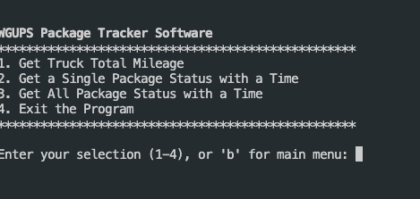
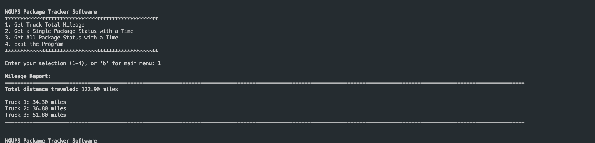
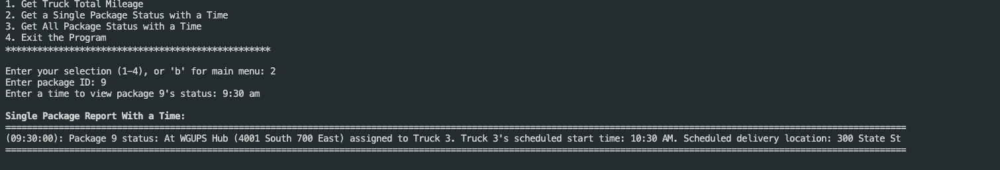
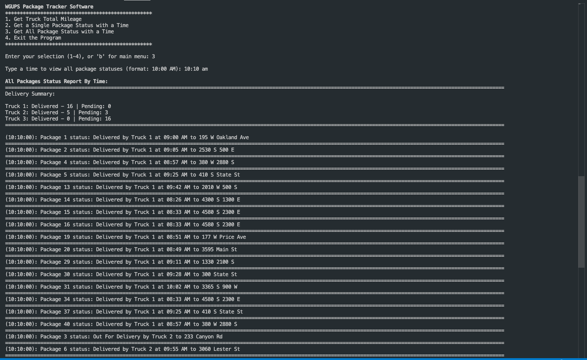

# Package-Delivery-CLI  

### Requirements  
•  Each truck can carry a maximum of 16 packages, and the ID number of each package is unique.  
•  The trucks travel at an average speed of 18 miles per hour and have an infinite amount of gas with no need to stop.  
•  There are no collisions.  
•  Three trucks and two drivers are available for deliveries. Each driver stays with the same truck as long as that truck is in service.  
•  Drivers leave the hub no earlier than 8:00 a.m., with the truck loaded, and can return to the hub for packages if needed.  
•  The delivery and loading times are instantaneous (i.e., no time passes while at a delivery or when moving packages to a truck at the hub). This time is factored into the calculation of the average speed of the trucks.  
•  There is up to one special note associated with a package.  
•  The delivery address for package #9, Third District Juvenile Court, is wrong and will be corrected at 10:20 a.m. WGUPS is aware that the address is incorrect and will be updated at 10:20 a.m. However, WGUPS does not know the correct address (410 S. State St., Salt Lake City, UT 84111) until 10:20 a.m.  
•  The distances provided in the “WGUPS Distance Table” are equal regardless of the direction traveled.  
•  The day ends when all 40 packages have been delivered.  

## Try it out  

```bash
git clone https://github.com/TrevorEngland23/Package-Delivery-CLI.git
```  

## POC  

  
  




